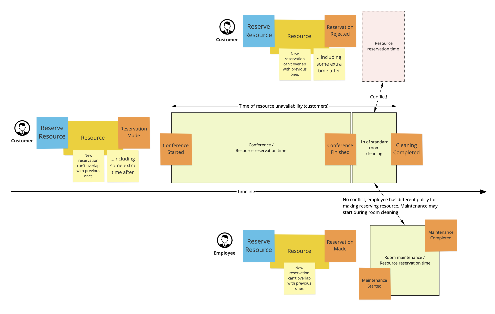

## README

This project is a simple implementation of a requirements in files `requirements.png` and `requirements.pdf` files. The goal is to create a scheduling functionality with flexible policies that can be used to schedule tasks in a system. 



### How to run the project

This project is built using TypeScript and Node.js. To run the project, you need to have Node.js and pnpm installed on your machine.

1. Clone the repository
```bash
git clone git@github.com:rkarbowiak/ddd-homework.git
```

2. Change directory to the project folder
```bash
cd ddd-homework
```

3. Install dependencies
```bash
pnpm install
```

4. Run the project
```bash
pnpm dev
```

5. Run tests
```bash
pnpm test
```

### Project structure
```bash
.
├── src
│   ├── vo
│   │   ├── duration.ts
│   │   ├── period.ts
│   │   └── response.ts
│   ├── models
│   │   ├── schedule.ts
│   ├── policies
│   │   ├── limited-time-policy.ts
│   │   ├── time-between-reservations-policy.ts
│   ├── interfaces
│   │   ├── satisfies.ts